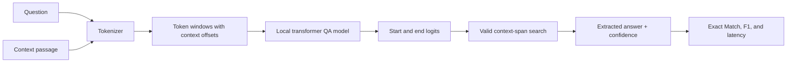

# Extractive Question Answering with Transformers

A local question-answering system that accepts a context passage and a
question, then extracts the most likely answer span directly from that passage.
This is Elevvo NLP Internship **Task 6**.

The project uses Hugging Face Transformers, the SQuAD v1.1 validation set,
transparent Exact Match and token-level F1 metrics, a reproducible two-model
comparison, and a Streamlit interface. It does not call a paid API.

## What the project demonstrates

- Extractive question answering rather than free-form generation
- Joint tokenization of a question and its context
- Direct start-token and end-token inference with Transformers 5
- Context-only span validation and long-context overflow windows
- Official-style SQuAD answer normalization, Exact Match, and token F1
- Measured comparison of DistilBERT and MiniLM
- Lazy local model loading in a Streamlit application
- Test-driven input, dataset, metric, model, reporting, and UI boundaries

## Pipeline



The model does not compose a new answer. It assigns a score to every possible
start token and end token. The application considers only tokens belonging to
the context, rejects impossible spans, limits answer length, and maps the best
token span back to exact character offsets in the original passage.

For passages longer than one model window, the tokenizer creates overlapping
windows. The same validated span search runs over every window and keeps the
highest-scoring result.

## Benchmark results

Both models were evaluated on the same first 100 examples from the SQuAD v1.1
validation split, using CPU inference on the development machine.

| Model | Exact Match | Token F1 | Mean latency |
|---|---:|---:|---:|
| DistilBERT cased distilled SQuAD | 83.00 | 88.25 | 219.4 ms |
| MiniLM uncased SQuAD2 | **93.00** | **95.93** | **137.7 ms** |

MiniLM is the default UI model because it achieved both the higher F1 score and
lower mean latency in this fixed comparison. These subset results demonstrate
the evaluation pipeline; they are not claims about full-dataset or production
performance. Re-run the script with a larger limit for a stronger benchmark.

The complete aggregate and per-example evidence is stored in
[`reports/model_comparison.json`](reports/model_comparison.json).

## Understanding the metrics

**Exact Match (EM)** is 100% for an example only when the normalized prediction
matches an accepted reference answer exactly. Normalization lowercases text and
removes punctuation, English articles, and duplicate whitespace.

**Token F1** gives partial credit when the predicted and reference answers share
tokens. It combines token precision and recall:

```text
F1 = 2 * precision * recall / (precision + recall)
```

When SQuAD provides multiple accepted answers, the prediction receives its best
EM and F1 score across those references.

## Project structure

```text
task-06-question-answering/
|-- app.py                         # Streamlit interface
|-- reports/
|   |-- README.md                  # Evaluation scope and reproduction notes
|   `-- model_comparison.json      # Auditable 100-example benchmark
|-- scripts/
|   `-- evaluate_models.py         # Multi-model benchmark CLI
|-- src/question_answering/
|   |-- dataset.py                 # SQuAD loading and answer-span validation
|   |-- evaluation.py              # Per-example and aggregate model evaluation
|   |-- metrics.py                 # Transparent SQuAD EM and token F1
|   |-- model.py                   # Direct tokenizer/model span inference
|   |-- reporting.py               # Reproducible JSON comparison reports
|   `-- ui.py                      # Safe highlighted-answer rendering
|-- tests/                         # Offline deterministic test suite
|-- requirements.txt
`-- requirements-dev.txt
```

## Setup on Windows

From this project directory:

```powershell
python -m venv .venv
.\.venv\Scripts\Activate.ps1
python -m pip install -r requirements-dev.txt
```

No API key, billing account, or Hugging Face account is required. The first
model or dataset run downloads public files from the Hugging Face Hub and caches
them locally. Model weights and dataset caches are intentionally ignored by Git.

The pinned PyTorch package is CPU-only on the tested Windows setup. CPU inference
works correctly. To use CUDA, install the PyTorch build matching your GPU and
CUDA version from the official PyTorch installation selector, then choose
`cuda` or `auto` in the app.

## Run the application

```powershell
streamlit run app.py
```

The model is loaded only after **Extract answer** is clicked. Try the supplied
Nile example or replace both fields with your own passage and question.

The result includes:

- The extracted answer
- Model confidence
- Exact character offsets
- The answer highlighted safely inside the original context
- The model used for inference

## Reproduce the model comparison

```powershell
python scripts\evaluate_models.py --limit 100 --device cpu
```

Useful options:

```powershell
# Evaluate one model
python scripts\evaluate_models.py --limit 100 --model "distilbert/distilbert-base-cased-distilled-squad"

# Evaluate more validation examples
python scripts\evaluate_models.py --limit 500 --device cpu

# Write to another report path
python scripts\evaluate_models.py --limit 100 --output reports\my_comparison.json
```

Every model is evaluated on exactly the same examples. The report ranks models
by highest token F1, then lowest mean latency when F1 is tied.

## Run the tests

```powershell
python -m pytest -q
python -m compileall -q app.py src tests scripts
python -m pip check
```

The deterministic tests do not download model weights or datasets. They cover
malformed SQuAD records, mismatched answer offsets, metric edge cases, invalid
model spans, context-only token selection, maximum answer length, evaluation
aggregation, report output, HTML escaping, and Streamlit startup.

## Main design decisions

- **Direct Transformers inference:** Transformers 5.15 no longer registers the
  old extractive `question-answering` convenience pipeline. Using
  `AutoTokenizer` and `AutoModelForQuestionAnswering` exposes the real
  start/end-token mechanics and avoids a removed API.
- **Extract the original context slice:** even if a backend normalizes casing,
  the displayed answer comes from the original passage using validated
  character offsets.
- **Transparent metrics:** EM and F1 are implemented in small tested functions
  instead of hiding the evaluation inside a service.
- **Dependency injection at the model boundary:** unit tests use deterministic
  answerers while real model downloads are verified separately.
- **Data-driven default:** the faster, higher-F1 model in the recorded comparison
  is selected by default, while both choices remain available in the UI.

## Limitations

- Models are English checkpoints and are not intended for multilingual QA.
- Extractive QA cannot answer correctly when the answer is absent from the
  supplied context; SQuAD v1.1 contains answerable questions.
- Confidence is a model score, not a guarantee of correctness.
- Very long passages require multiple windows and therefore more inference time.
- The committed benchmark uses a 100-example subset and CPU timing from one
  machine, so latency and aggregate scores will vary by hardware and sample.

## References

- [Hugging Face question answering guide](https://huggingface.co/docs/transformers/main/tasks/question_answering)
- [Hugging Face Datasets loading guide](https://huggingface.co/docs/datasets/en/loading)
- [SQuAD dataset](https://huggingface.co/datasets/rajpurkar/squad)
- [DistilBERT SQuAD model](https://huggingface.co/distilbert/distilbert-base-cased-distilled-squad)
- [MiniLM SQuAD2 model](https://huggingface.co/deepset/minilm-uncased-squad2)
