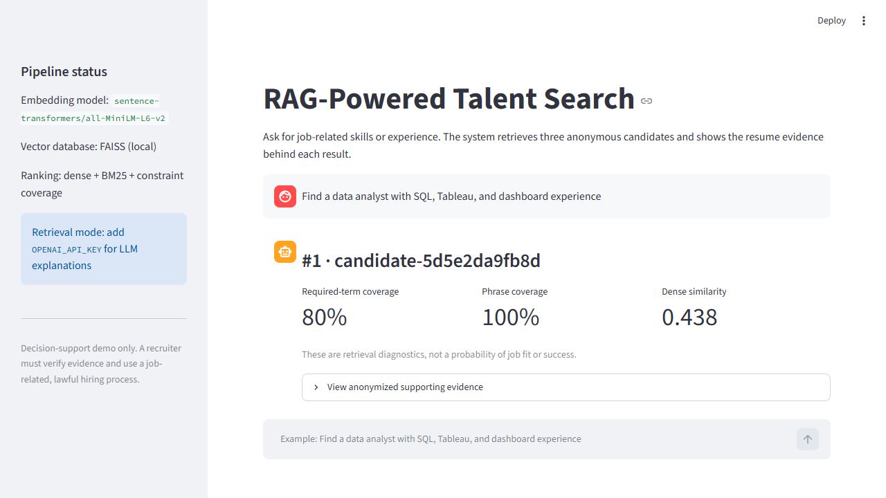
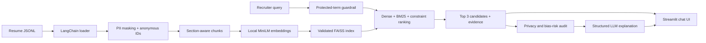

# Task 08: RAG-Powered Talent Search Engine

A privacy-aware, LangChain-first RAG application that searches 220 resumes with
natural language, returns three anonymous candidates, and explains the evidence
behind each result. It combines local embeddings, FAISS, hybrid retrieval,
optional structured OpenAI evaluation, bias-risk guardrails, and a Streamlit
chat interface.



## What the project solves

Recruiters should not need to read hundreds of resumes to answer a focused
question such as:

> Find a data analyst with SQL, Tableau, and dashboard experience.

The system retrieves relevant evidence, groups chunks into distinct candidates,
and shows why each result appeared. Candidate identity and contact information
are removed before embedding, indexing, retrieval, or LLM evaluation.

## Complete pipeline



The LLM is intentionally downstream from retrieval. It does not choose which
candidates rank highest; it receives bounded, score-neutral, privacy-safe
evidence and explains supported strengths, missing requirements, and
uncertainty.

## Verified results

The real dataset run produced:

- 220 resumes;
- 1,956 privacy-safe section chunks;
- normalized `1956 x 384` embeddings from
  `sentence-transformers/all-MiniLM-L6-v2`;
- 1,956 vectors in an exact cosine-similarity FAISS index;
- no detected email or URL pattern in the final chunks or persisted documents.

The same eight manually labelled queries were used before and after hybrid
ranking:

| Metric | Dense baseline | Final hybrid |
|---|---:|---:|
| Hit rate@3 | 0.500 | **1.000** |
| Mean candidate Recall@3 | 0.281 | **0.906** |
| Mean candidate Precision@3 | 0.250 | **0.625** |
| Mean reciprocal rank | 0.438 | **0.938** |
| Mean evidence-section recall@3 | 0.219 | **0.875** |

The seed set is small and rich in explicit skill terms. These results verify
the implementation and justify the hybrid design, but they are not evidence of
production hiring quality.

## How ranking works

The final retriever combines:

1. dense semantic rank from FAISS;
2. candidate-level BM25 lexical rank;
3. coverage of meaningful query terms;
4. coverage of multiword constraints such as `machine learning` or `team lead`;
5. reciprocal-rank fusion.

Evidence selection then prefers chunks that cover the query while keeping at
most one chunk from each section. The UI labels all scores as retrieval
diagnostics—not probabilities of fit, performance, or hiring success.

## Setup on Windows

```powershell
python -m venv .venv
.\.venv\Scripts\Activate.ps1
pip install -r requirements-dev.txt
```

The first run downloads the local embedding model; later runs reuse the
Hugging Face cache.

The Kaggle dataset is intentionally excluded from Git. Build the private local
index by passing its path:

```powershell
python scripts\build_index.py "C:\path\to\Entity Recognition in Resumes.json"
```

The command writes `.artifacts/faiss_index`, which is Git-ignored. It refuses to
overwrite an existing index. Loading validates the format, embedding model,
vector count, dimensions, document fingerprint, IDs, and privacy marker.

## Run the recruiter interface

Retrieval works without a paid API:

```powershell
streamlit run streamlit_app.py
```

To enable the optional grounded LLM explanations, set the variables shown in
`.env.example` in your shell before starting Streamlit:

```powershell
$env:OPENAI_API_KEY = "your-key"
$env:TALENT_SEARCH_LLM_PROVIDER = "openai"
$env:TALENT_SEARCH_LLM_MODEL = "gpt-5.6"
streamlit run streamlit_app.py
```

No key is committed or printed. If the key is absent, the UI remains usable and
clearly identifies retrieval-only mode.

## Evaluate and test

Run the checked-in retrieval benchmark:

```powershell
python scripts\evaluate_retrieval.py
```

Run all automated tests:

```powershell
$env:PYTHONPATH = "$PWD\src"
pytest -q
```

The tests cover dataset loading, privacy masking, section splitting,
embeddings, FAISS search and persistence, dense and hybrid retrieval,
evaluation metrics, protected-term filtering, bias-risk auditing, provider
configuration, bounded LLM evidence, structured-output validation, and the
application service workflow.

## LLM evaluation safety

The LangChain evaluation layer:

- supplies only retrieved, privacy-masked sections;
- omits ranking scores from the model evidence;
- limits evidence characters per chunk and candidate;
- requires a strict Pydantic schema;
- rejects unknown candidate IDs and invented evidence sections;
- asks for strengths, gaps, and uncertainty rather than a hiring decision;
- blocks LLM evaluation if the evidence fails its safety audit.

The structured boundary is fully tested with deterministic fake chains. A live
provider response was not executed in the verified development environment
because no API key was available.

## Bias-check bonus

This feature removes protected-demographic filters from recruiter queries
before retrieval, rejects searches containing no job-related requirement,
audits result metadata and evidence for sensitive fields or privacy failures,
and provides a counterfactual ranking-comparison helper.

Passing these checks does **not** prove that the dataset, model, ranking, or
hiring process is unbiased. The UI says this explicitly and positions the
project as decision support requiring human review.

## Project map

```text
streamlit_app.py                  recruiter chat interface
scripts/build_index.py           reproducible private-index build
scripts/evaluate_retrieval.py    repeatable retrieval benchmark
src/talent_search/loaders.py     JSONL -> LangChain Documents
src/talent_search/privacy.py     PII masking and anonymous IDs
src/talent_search/splitting.py   section-aware chunking
src/talent_search/embeddings.py  local normalized embeddings
src/talent_search/vector_store.py validated FAISS adapter and persistence
src/talent_search/retrieval.py   candidate aggregation and hybrid ranking
src/talent_search/evaluation.py  retrieval metrics
src/talent_search/llm_evaluation.py grounded structured explanations
src/talent_search/bias.py        query and result guardrails
src/talent_search/service.py     end-to-end application workflow
evaluation/                      labels, baseline, and error analysis
tests/                           unit and workflow regression tests
```

For the reasoning and measurements behind every phase, see
[`LEARNING_LOG.md`](LEARNING_LOG.md). The completion checklist and honest
verification boundaries are in [`PROJECT_ROADMAP.md`](PROJECT_ROADMAP.md).
