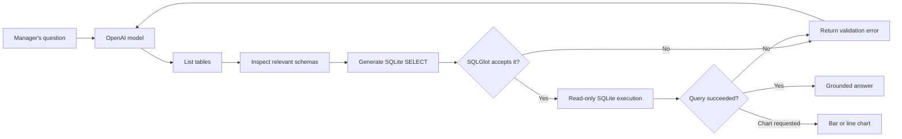

# Autonomous Text-to-SQL Agent

An AI data analyst that translates natural-language business questions into
SQLite queries, executes them safely, corrects SQL errors automatically, and
summarizes verified results. This is Elevvo NLP Internship **Task 10**.

## What the project demonstrates

- LangChain agent and OpenAI function calling
- Database schema discovery before SQL generation
- Natural-language-to-SQL translation
- Automatic correction after invalid SQL
- SQLGlot validation plus SQLite read-only connections
- A Streamlit chat interface with an SQL audit trail
- An optional chart tool for bar and line visualizations
- Deterministic unit and integration tests that do not require API credit

## Pipeline



The important detail is the feedback loop. A failed query is returned to the
model as a tool result. The model reads the database error, rewrites the SQL,
and tries again instead of crashing or inventing an answer.

## Safety design

The agent has no general database connection. It receives four narrow tools:

1. `list_database_tables`
2. `inspect_table_schema`
3. `run_read_only_query`
4. `create_chart`

Every query passes through SQLGlot. Only one parsed query expression is
accepted, while `INSERT`, `UPDATE`, `DELETE`, `DROP`, `PRAGMA`, and multiple
statements are rejected. SQLite is also opened with `mode=ro`, providing a
second independent read-only boundary. Results are limited to 100 rows (50 for
charts).

## Project structure

```text
task-10-text-to-sql-agent/
|-- app.py                         # Streamlit chat interface
|-- scripts/download_chinook.py    # Reproducible dataset setup
|-- src/text_to_sql_agent/
|   |-- agent.py                   # Agent loop, prompt, and audit result
|   |-- database.py                # Read-only SQLite operations
|   |-- database_tools.py          # LangChain tools and chart tool
|   |-- dataset.py                 # Download and schema validation
|   |-- model.py                   # OpenAI model configuration
|   `-- sql_validation.py          # SQLGlot safety policy
|-- tests/                         # Offline automated test suite
|-- requirements.txt
`-- requirements-dev.txt
```

## Setup on Windows

From this project directory:

```powershell
python -m venv .venv
.\.venv\Scripts\Activate.ps1
python -m pip install -r requirements-dev.txt
python scripts\download_chinook.py
```

Create an OpenAI API key in the
[OpenAI Platform](https://platform.openai.com/api-keys), then save it as a
Windows user environment variable:

```powershell
setx OPENAI_API_KEY "your_api_key_here"
```

Close and reopen the terminal after `setx`. Never commit an API key. OpenAI API
billing is separate from a ChatGPT subscription, so the API account must have
available credit.

## Run the application

```powershell
streamlit run app.py
```

Then try questions such as:

- Which customer has spent the most in total?
- What are the five best-selling artists by revenue?
- Which countries generated the most invoice revenue?
- Show revenue by country as a bar chart.
- Compare monthly sales over time with a line chart.

The **SQL audit trail** under each answer shows every SQL attempt, which makes
the agent's work inspectable and turns failures into a learning opportunity.

## Run the tests

```powershell
python -m pytest -q
python -m pip check
```

The test suite covers SQL safety, read-only enforcement, schema inspection,
row limits, connection cleanup, LangChain tool execution, model configuration,
automatic SQL correction, chart preparation, dataset validation, provider
error handling, and Streamlit startup.

## Main design decisions

- **LangChain `create_agent`:** provides the model/tool loop and returns tool
  errors to the model for self-correction.
- **`gpt-4o-mini`:** a low-cost model that supports function calling and is
  sufficient for this focused portfolio task. Change `DEFAULT_MODEL` in
  `src/text_to_sql_agent/model.py` to experiment with another supported model.
- **Tools instead of direct access:** the model proposes actions; trusted Python
  code validates and performs them.
- **Structured tool results:** errors, columns, rows, row counts, and truncation
  are explicit, allowing both the model and UI to reason about outcomes.
- **Local SQLite:** keeps the project reproducible and avoids infrastructure
  requirements while preserving realistic joins and analytics queries.

## Current limitations

- LLM-generated SQL is probabilistic, so important business answers should be
  reviewed using the displayed SQL and returned data.
- The implementation targets SQLite and the Chinook schema.
- Conversation history is stored only in the current Streamlit session.
- This educational application does not include production authentication,
  per-user budgets, telemetry, or deployment hardening.

## References

- [OpenAI function calling](https://developers.openai.com/api/docs/guides/function-calling)
- [LangChain agents](https://docs.langchain.com/oss/python/langchain/agents)
- [LangChain ChatOpenAI integration](https://docs.langchain.com/oss/python/integrations/chat/openai)
- [Chinook sample database](https://github.com/lerocha/chinook-database)
